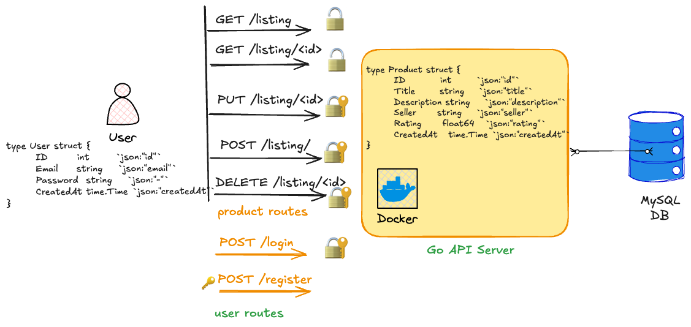

***note**: hi seniors, if you are looking for the hosted url as mentioned later in the readme, i couldn't host a go backend on a serverless environment (e.g., vercel, netlify). to compensate, i have added a dockerfile to spin it up locally with just one command. i also included a handy shell script to test all endpoints in one go. still, if you want me to host it temporarily, lmk in my uni email; i'll be happy to do so.*

---

## quick start

steps here are for unix (macOS and linux) systems, if you are on windows use WSL.

### with docker

make sure you have docker (and the plugin `docker-compose`) installed.

```
git clone https://github.com/vimfn/gdgc_task_round_backend --depth=1
cd gdgc_task_round_backend
docker compose up --build
```

### without docker (more pain)

step 1: make sure you have a mysql database running locally, you can update envs using `.env.example`.

```
DB_USER=root
DB_PASSWORD=mypassword
DB_HOST=127.0.0.1
DB_PORT=3306
DB_NAME=vitshop
```
step 2: run the `migration.sql` to get the products table and seed with same sample data.

step 3: install [air](https://github.com/air-verse/air) to have hot reloads and other cool stuff.

```
air -c .air.toml
```

with gnu makefiles

```
make run
```

## good to know 

- written in go, not ts/js or nodejs/deno/bun
- uses *repository pattern*, diff stores for each services
    - basically what it means is the business logic and database logic is seperate and easy tests
- no bloated orms
    - uses mysql databases with raw queries
- one line up and running with docker compose
    - i remeber one of the tasks asked to deploy it to vercel or netlify but afaik they don't support go (serverless is not an option here)
- introduced additional jwt auth for user login and resiter (do `git checkout protected`)
    - for the routes CREATE, PATCH, PUT, DELETE while READ is open
- a minimal shell script (not real) which will hopefully pass all test cases of the given task
    - lmk if you want me to add some real test

## architecture overview


